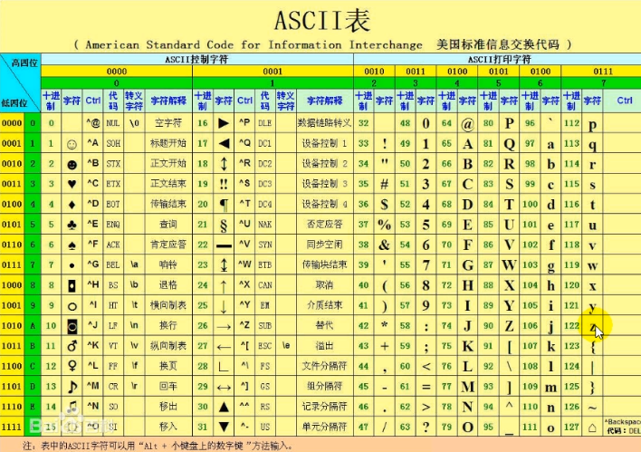
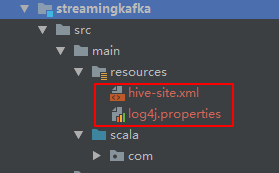

# 一、实现功能

producer随机生成一个a-z单词，并且发送到kafka的wc主题下；

streaming从kafka消费进行wordcount统计；

利用redis统计单词累计出现次数。

# 二、实现步骤

1.kafka创建wc主题

2.创建生产者发送a-z单词

3.streaming从kafka的wc主题下消费数据，并且进行wc统计

4.将结果存储到redis，并且给予incrBy Api递增统计。


# 三、代码

## 1.kafka随机生成a-z代码



```scala
package com.ray.spark.kafkaGenerator

import java.util.Properties
import org.apache.kafka.clients.producer.{KafkaProducer, ProducerRecord, RecordMetadata}

import scala.util.Random

/**
  * 实现producer
  * producer随机生成a-z的单词，发送到kafka的wc主题下
  *
  */
object KafkaProducerDemo {
  def main(args: Array[String]): Unit = {
    val prop = new Properties
    // 指定请求的kafka集群列表
    prop.put("bootstrap.servers", "hadoop:9092")// 指定响应方式
    //prop.put("acks", "0")
    prop.put("acks", "all")
    // 请求失败重试次数
    //prop.put("retries", "3")
    // 指定key的序列化方式, key是用于存放数据对应的offset
    prop.put("key.serializer", "org.apache.kafka.common.serialization.StringSerializer")
    // 指定value的序列化方式
    prop.put("value.serializer", "org.apache.kafka.common.serialization.StringSerializer")
    // 配置超时时间
    prop.put("request.timeout.ms", "60000")
    //prop.put("batch.size", "16384")
    //prop.put("linger.ms", "1")
    //prop.put("buffer.memory", "33554432")

    // 得到生产者的实例
    val producer = new KafkaProducer[String, String](prop)

    // 模拟一些数据并发送给kafka
    for (i <- 1 to 10) {
      val index=new Random().nextInt(26)+97
      val ASCIICode=index.asInstanceOf[Char]
      val msg = s"$ASCIICode"
      println("send -->" + msg)
      // 得到返回值
      val rmd: RecordMetadata = producer.send(new ProducerRecord[String, String]("wc",msg, msg)).get()
      println(rmd.toString)
      Thread.sleep(500)
    }

    producer.close()
  }
}
```


## 2.新建redis链接工具类

### 2.1 导入依赖

```xml
    <dependency>
      <groupId>redis.clients</groupId>
      <artifactId>jedis</artifactId>
      <version>2.9.0</version>
    </dependency>
```

### 2.2 Jedis链接工具类

```scala
package com.ray.spark.utils

import redis.clients.jedis.{JedisPool, JedisPoolConfig}


/**
  * redis连接池
  *
  */
object JedisPools {

  private val jedisPoolConfig=new JedisPoolConfig()
  jedisPoolConfig.setMaxTotal(2000)
  jedisPoolConfig.setMaxIdle(1000)
  jedisPoolConfig.setMinIdle(100)
  jedisPoolConfig.setTestOnBorrow(true)
  jedisPoolConfig.setTestOnReturn(true)

  private val jedisPool=new JedisPool(jedisPoolConfig,"192.168.0.8") //hadoop

  //获取jedis链接
  def getJedis=jedisPool.getResource


  def main(args: Array[String]): Unit = {
    val jedis=getJedis

    jedis.set("key1","value1")

    jedis.close()
  }


}
```


## 2.streaming消费kafka并且存储到redis

###  2.1 将spark的conf下的log4j.properties和hive-site.xml放到resources目录下



### 2.2 依赖添加spark相关，并且去除kafka相关，因为spark-kafka包含kafka相关依赖！

否则容易爆jar包冲突的问题

```xml
  <dependencies>
    <dependency>
      <groupId>org.scala-lang</groupId>
      <artifactId>scala-library</artifactId>
      <version>${scala.version}</version>
    </dependency>

<!--    <dependency>-->
<!--      <groupId>org.apache.kafka</groupId>-->
<!--      <artifactId>kafka-clients</artifactId>-->
<!--      <version>0.10.0.0</version>-->
<!--&lt;!&ndash;      <exclusions>&ndash;&gt;-->
<!--&lt;!&ndash;        <exclusion>&ndash;&gt;-->
<!--&lt;!&ndash;          <artifactId>jackson-databind</artifactId>&ndash;&gt;-->
<!--&lt;!&ndash;          <groupId>com.fasterxml.jackson.core</groupId>&ndash;&gt;-->
<!--&lt;!&ndash;        </exclusion>&ndash;&gt;-->
<!--&lt;!&ndash;      </exclusions>&ndash;&gt;-->
<!--    </dependency>-->
<!--    <dependency>-->
<!--      <groupId>org.apache.kafka</groupId>-->
<!--      <artifactId>kafka_2.11</artifactId>-->
<!--      <version>1.1.0</version>-->
<!--&lt;!&ndash;      <exclusions>&ndash;&gt;-->
<!--&lt;!&ndash;        <exclusion>&ndash;&gt;-->
<!--&lt;!&ndash;          <artifactId>jackson-databind</artifactId>&ndash;&gt;-->
<!--&lt;!&ndash;          <groupId>com.fasterxml.jackson.core</groupId>&ndash;&gt;-->
<!--&lt;!&ndash;        </exclusion>&ndash;&gt;-->
<!--&lt;!&ndash;      </exclusions>&ndash;&gt;-->
<!--    </dependency>-->


    <!-- Spark Streaming -->
    <dependency>
      <groupId>org.apache.spark</groupId>
      <artifactId>spark-streaming_2.11</artifactId>
      <version>2.1.0</version>
      <scope>compile</scope>
    </dependency>
    <dependency>
      <groupId>org.apache.spark</groupId>
      <artifactId>spark-streaming-kafka-0-10_2.11</artifactId>
      <version>2.1.0</version>
    </dependency>

    <dependency>
      <groupId>redis.clients</groupId>
      <artifactId>jedis</artifactId>
      <version>2.9.0</version>
    </dependency>
  </dependencies>
```


### 2.3 代码

```scala
package com.ray.spark.kafkaGenerator

import java.util.Properties
import org.apache.kafka.clients.producer.{KafkaProducer, ProducerRecord, RecordMetadata}
import scala.util.Random

/**
  * 实现producer
  * producer随机生成a-z的单词，发送到kafka的wc主题下
  *
  */
object KafkaProducerDemo {
  def main(args: Array[String]): Unit = {
    val prop = new Properties
    // 指定请求的kafka集群列表
    prop.put("bootstrap.servers", "hadoop:9092")// 指定响应方式
    //prop.put("acks", "0")
    prop.put("acks", "all")
    // 请求失败重试次数
    //prop.put("retries", "3")
    // 指定key的序列化方式, key是用于存放数据对应的offset
    prop.put("key.serializer", "org.apache.kafka.common.serialization.StringSerializer")
    // 指定value的序列化方式
    prop.put("value.serializer", "org.apache.kafka.common.serialization.StringSerializer")
    // 配置超时时间
    prop.put("request.timeout.ms", "60000")
    //prop.put("batch.size", "16384")
    //prop.put("linger.ms", "1")
    //prop.put("buffer.memory", "33554432")

    // 得到生产者的实例
    val producer = new KafkaProducer[String, String](prop)

    // 模拟一些数据并发送给kafka
    for (i <- 1 to 10) {
      val index=new Random().nextInt(26)+97
      val ASCIICode=index.asInstanceOf[Char]
      val msg = s"$ASCIICode"
      println("send -->" + msg)
      // 得到返回值
      val rmd: RecordMetadata = producer.send(new ProducerRecord[String, String]("wc",msg, msg)).get()
      println(rmd.toString)
      Thread.sleep(500)
    }

    producer.close()
  }
}
```

