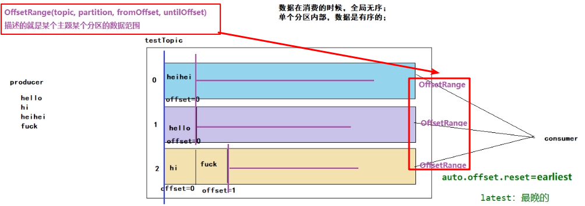

参考：[链接](https://www.bilibili.com/video/BV114411G776?p=4)

# 一、实现功能


手动提交偏移量。


# 二、实现关键点

## 1.关键类OffsetRange

源码

```scala
/**
 * Represents a range of offsets from a single Kafka TopicPartition. Instances of this class
 * can be created with `OffsetRange.create()`.
 * @param topic Kafka topic name
 * @param partition Kafka partition id
 * @param fromOffset Inclusive starting offset
 * @param untilOffset Exclusive ending offset
 */
final class OffsetRange private(
    val topic: String,
    val partition: Int,
    val fromOffset: Long,
    val untilOffset: Long) extends Serializable {
  import OffsetRange.OffsetRangeTuple
```

包含：topic、parition分区、fromOffset开始偏移量、untilOffset截至偏移量。


## 2.获取RDD中数据信息

获取topic、partition，以及起始位置、结束位置。

### 关键点：偏移量信息一定要从stream最初的rdd中获取。


## 3.提交偏移量到spark

通过stream强转为CanCommitOffsets后，再通过异步提交运行。

```scala
...
      /**
        * 2.提交偏移量
        */      stream.asInstanceOf[CanCommitOffsets].commitAsync(ranges)

...
```


## 4.关系图




# 三、实现代码

## 1.代码

```scala
package com.ray.spark.spark

import com.ray.spark.utils.JedisPools
import org.apache.kafka.clients.consumer.ConsumerRecord
import org.apache.kafka.common.serialization.StringDeserializer
import org.apache.spark.SparkConf
import org.apache.spark.streaming.dstream.InputDStream
import org.apache.spark.streaming.kafka010.{CanCommitOffsets, ConsumerStrategies, HasOffsetRanges, KafkaUtils, LocationStrategies, OffsetRange}
import org.apache.spark.streaming.{Seconds, StreamingContext}

/**
  * 实现功能
  * spark统计kafka单词数量，并且把累加结果输入到redis中
  *
  */
object spark2commitOffsetByHand {

  def main(args: Array[String]): Unit = {

    //创建 SparkConf 对象
    val sparkConf: SparkConf = new
        SparkConf().setMaster("local[*]").setAppName("KafkaStreaming")
    //创建 StreamingContext 对象
    val ssc: StreamingContext = new StreamingContext(sparkConf, Seconds(3))
    //kafka 参数声明
    val brokers = "hadoop:9092" //"hadoop101:9092,hadoop102:9092"
    val topic = "wc"
    val group = "bigdata3"
    val deserialization = "org.apache.kafka.common.serialization.StringDeserializer"

    val kafkaParams = Map[String, Object](
      "auto.offset.reset" -> "earliest", //latest,earliest
      "value.deserializer" -> classOf[StringDeserializer],
      "key.deserializer" -> classOf[StringDeserializer],
      "bootstrap.servers" -> brokers,
      "group.id" -> group,
      "enable.auto.commit" -> (false: java.lang.Boolean) //true：自动提交；false：不自动提交，手动提交
    )

    var stream: InputDStream[ConsumerRecord[String, String]] = null
    val topics = Array("wc")

    stream = KafkaUtils.createDirectStream[String, String](
      ssc,
      LocationStrategies.PreferConsistent,
      ConsumerStrategies.Subscribe[String, String](topics, kafkaParams)
    )

    //处理数据
    stream.foreachRDD(rdd => {
      /**
        * 1.获取当前rdd信息OffsetRange：来自哪个topic，partition，偏移量起始位置
        * ranges.sized大小=主题分区数目
        *
        */
      val ranges: Array[OffsetRange] = rdd.asInstanceOf[HasOffsetRanges].offsetRanges

      val words=rdd.map(_.value()).map(line=>line.split(" "))

      val word=words.flatMap(arr=>arr.map(word=>(word,1)))
      val wordCountResult=word.reduceByKey(_+_)

      wordCountResult.foreach(println)


      /**
        * 2.提交偏移量
        */
      stream.asInstanceOf[CanCommitOffsets].commitAsync(ranges)


    })


    ssc.start()
    ssc.awaitTermination()
  }
}

```

