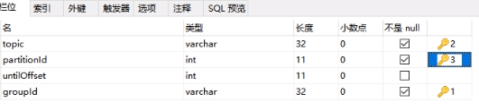
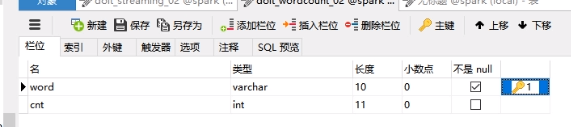

# 一、事务管理偏移量原因

正常流程计算结果成功后，再提交偏移量给kafka。但是，会有意外，计算成功，但是提交kafka的偏移量失败。这就导致，重新消费消息，有时候对待金融这方面应用是无法容忍的。所以，需要把计算结果和偏移量提交放到同一个事务中，要不都成功，要不都失败。


# 二、实现事务思路

## 1.事务解决

采用把偏移量保存到支持事务的数据库mysql中，实现整体控制！

## 2.Streaming偏移量获取

参考官网：http://spark.apache.org/docs/2.1.0/streaming-kafka-0-10-integration.html

```scala
stream.foreachRDD { rdd =>
  val offsetRanges = rdd.asInstanceOf[HasOffsetRanges].offsetRanges
  rdd.foreachPartition { iter =>
    val o: OffsetRange = offsetRanges(TaskContext.get.partitionId)
    println(s"${o.topic} ${o.partition} ${o.fromOffset} ${o.untilOffset}")
  }
}
```


# 三、mysql存储表

## 3.1 存储偏移量表spark_kafka_offset

设定复合主键

```sql
CREATE TABLE `sparkProjects`.`Untitled`  (
  `topic` varchar(32) NOT NULL,
  `partitionId` int(12) NOT NULL,
  `untilOffset` int(12) NULL,
  `groupId` varchar(32) NOT NULL,
  PRIMARY KEY (`topic`, `partitionId`, `groupId`)
);
```




## 3.2 存储单词统计结果表spark_wc



```sql
CREATE TABLE `sparkProjects`.`Untitled`  (
  `word` varchar(32) NOT NULL,
  `cnt` int(12) NULL,
  PRIMARY KEY (`word`)
);
```


# 四、实现代码

## 1.关键点

### 1.1 sql：插入或更新

### 1.2 批次插入

### 1.3 偏移量获取


## 2.具体实现

```scala
package com.ray.spark.spark

import com.ray.spark.utils.c3p0Pools
import org.apache.kafka.clients.consumer.ConsumerRecord
import org.apache.kafka.common.serialization.StringDeserializer
import org.apache.spark.{SparkConf, TaskContext}
import org.apache.spark.streaming.dstream.InputDStream
import org.apache.spark.streaming.kafka010._
import org.apache.spark.streaming.{Seconds, StreamingContext}

/**
  * 实现功能
  * spark统计kafka单词数量，并且把累加结果输入到redis中
  *
  */
object spark2commitOffsetInTransaction {

  def main(args: Array[String]): Unit = {

    //创建 SparkConf 对象
    val sparkConf: SparkConf = new
        SparkConf().setMaster("local[2]").setAppName("spark2commitOffsetInTransaction")
    //创建 StreamingContext 对象
    val ssc: StreamingContext = new StreamingContext(sparkConf, Seconds(3))
    //kafka 参数声明
    val brokers = "hadoop:9092" //"hadoop101:9092,hadoop102:9092"
    val topic = "wc"
    val group = "bigdata4"
    val deserialization = "org.apache.kafka.common.serialization.StringDeserializer"

    val kafkaParams = Map[String, Object](
      "auto.offset.reset" -> "earliest", //latest,earliest
      "value.deserializer" -> classOf[StringDeserializer],
      "key.deserializer" -> classOf[StringDeserializer],
      "bootstrap.servers" -> brokers,
      "group.id" -> group,
      "enable.auto.commit" -> (false: java.lang.Boolean) //true：自动提交；false：不自动提交，手动提交
    )

    var stream: InputDStream[ConsumerRecord[String, String]] = null
    val topics = Array("wc")

    stream = KafkaUtils.createDirectStream[String, String](
      ssc,
      LocationStrategies.PreferConsistent,
      ConsumerStrategies.Subscribe[String, String](topics, kafkaParams)
    )

    //处理数据
    stream.foreachRDD(rdd => {
      /**
        * 1.获取当前rdd信息OffsetRange：来自哪个topic，partition，偏移量起始位置
        * ranges.sized大小=主题分区数目
        *
        */
      val ranges: Array[OffsetRange] = rdd.asInstanceOf[HasOffsetRanges].offsetRanges


      val words=rdd.map(_.value()).map(line=>line.split(" "))

      val word=words.flatMap(arr=>arr.map(word=>(word,1)))
      val wordCountResult=word.reduceByKey(_+_)

      wordCountResult.foreachPartition(iter=>{
        //获取连接
        val conn=c3p0Pools.getConnection
        //开启事务
        conn.setAutoCommit(false)
        /**
          * 1.存储偏移量
          */
        //获取当前分区偏移量范围
        val partitionRange= ranges(TaskContext.getPartitionId())
        val updatesql=
          """
            |insert into spark_kafka_offset(topic,partitionId,untilOffset,groupId)
            |values(?,?,?,?) on duplicate key update untilOffset=?
            |
        """.stripMargin
        val pstmt= conn.prepareStatement(updatesql)
        pstmt.setString(1,partitionRange.topic)
        pstmt.setInt(2,partitionRange.partition)
        pstmt.setLong(3,partitionRange.untilOffset)
        pstmt.setString(4,group) //组名
        pstmt.setLong(5,partitionRange.untilOffset)
        //执行
        pstmt.executeUpdate()


        /**
          * 2.存储计算结果
          */
        //将计算结果存入
        val wc_updatesql=
          """
            |insert into spark_wc(word,cnt)
            |values(?,?) on duplicate key update cnt=cnt+?
            |
        """.stripMargin
        val pstmt_wc= conn.prepareStatement(wc_updatesql)
        iter.foreach(tp=>{
          pstmt_wc.setString(1,tp._1)
          pstmt_wc.setInt(2,tp._2)
          pstmt_wc.setInt(3,tp._2)
          pstmt_wc.addBatch() //添加批次

        })
        pstmt_wc.executeBatch()//执行批次

        //事务提交
        conn.commit()

        //关闭资源
        if(pstmt!=null) pstmt.close()
        if(pstmt_wc!=null) pstmt_wc.close()
        if(conn!=null) conn.close()

      })


    })


    ssc.start()
    ssc.awaitTermination()
  }
}
```


