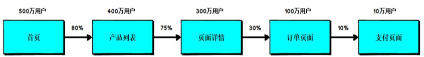

# Spark电商案例实操

## 一、数据准备

### 1.数据样例

在之前的学习中，我们已经学习了Spark的基础编程方式，接下来，我们看看在实际的工作中如何使用这些API实现具体的需求。这些需求是电商网站的真实需求，所以在实现功能前，咱们必须先将数据准备好。


上面的数据图是从数据文件中截取的一部分内容，表示为电商网站的用户行为数据，主要包含用户的4种行为：搜索，点击，下单，支付。数据规则如下：
	数据文件中每行数据采用下划线分隔数据
	每一行数据表示用户的一次行为，这个行为只能是4种行为的一种
	如果搜索关键字为null,表示数据不是搜索数据
	如果点击的品类ID和产品ID为-1，表示数据不是点击数据
	针对于下单行为，一次可以下单多个商品，所以品类ID和产品ID可以是多个，id之间采用逗号分隔，如果本次不是下单行为，则数据采用null表示
	支付行为和下单行为类似

### 2.详细字段说明：

```sh
编号	字段名称	字段类型	字段含义
1	date	String	用户点击行为的日期
2	user_id	Long	用户的ID
3	session_id	String	Session的ID
4	page_id	Long	某个页面的ID
5	action_time	String	动作的时间点
6	search_keyword	String	用户搜索的关键词
7	click_category_id	Long	某一个商品品类的ID
8	click_product_id	Long	某一个商品的ID
9	order_category_ids	String	一次订单中所有品类的ID集合
10	order_product_ids	String	一次订单中所有商品的ID集合
11	pay_category_ids	String	一次支付中所有品类的ID集合
12	pay_product_ids	String	一次支付中所有商品的ID集合
13	city_id	Long	城市 id
```


### 3.样例类：

```scala
//用户访问动作表
case class UserVisitAction(
    date: String,//用户点击行为的日期
    user_id: Long,//用户的ID
    session_id: String,//Session的ID
    page_id: Long,//某个页面的ID
    action_time: String,//动作的时间点
    search_keyword: String,//用户搜索的关键词
    click_category_id: Long,//某一个商品品类的ID
    click_product_id: Long,//某一个商品的ID
    order_category_ids: String,//一次订单中所有品类的ID集合
    order_product_ids: String,//一次订单中所有商品的ID集合
    pay_category_ids: String,//一次支付中所有品类的ID集合
    pay_product_ids: String,//一次支付中所有商品的ID集合
    city_id: Long
)//城市 id
```

### 4.[数据下载链接](https://pan.baidu.com/disk/home?#/all?vmode=list&path=%2F%E5%A4%A7%E6%95%B0%E6%8D%AE%2FXY%2F18-%E5%A4%A7%E6%95%B0%E6%8D%AE%E7%9B%B8%E5%85%B3%2F%E5%A4%A7%E6%95%B0%E6%8D%AE%2FSpark%2F2.%E8%B5%84%E6%96%99%2Fspark-core%E6%95%B0%E6%8D%AE)


## 二、需求1：Top10热门品类


### 2.1 需求说明

品类是指产品的分类，大型电商网站品类分多级，咱们的项目中品类只有一级，不同的公司可能对热门的定义不一样。我们按照每个品类的点击、下单、支付的量来统计热门品类。
鞋			点击数 下单数  支付数
衣服		点击数 下单数  支付数
电脑		点击数 下单数  支付数
例如，综合排名 = 点击数*20%+下单数*30%+支付数*50%
本项目需求优化为：~~先按照点击数排名，靠前的就排名高；如果点击数相同，再比较下单数；下单数再相同，就比较支付数。~~

### 2.2 实现方案一

#### 2.2.1 需求分析

分别统计每个品类点击的次数，下单的次数和支付的次数：
（品类，点击总数）（品类，下单总数）（品类，支付总数）


#### 2.2.2 需求实现

字段数组参考：


```scala
val dataRDD: RDD[String] = hotCategoryAnalysisTop10Dao.readFile("input/user_visit_action.txt")
// 因为RDD需要重复使用，所以可以将RDD缓存起来，重复使用。
val dataCacheRDD: RDD[String] = dataRDD.cache()

// TODO 将原始数据进行转换，形成对象，方便使用
//================================1=============================
// TODO 品类点击统计
val categoryClickRDD: RDD[(String, Int)] = dataCacheRDD.map(
    data => {
        val datas = data.split("_")
        // （品类，点击总数）
        (datas(6), 1)
    }
)
// (品类， 1)
val categoryClickFilterRDD = categoryClickRDD.filter(_._1 != "-1")
val categoryClickReduceRDD: RDD[(String, Int)] = categoryClickFilterRDD.reduceByKey(_+_)


//================================2=============================
// TODO 品类下单统计
val categoryOrderRDD: RDD[String] = dataCacheRDD.map(
    data => {
        val datas = data.split("_")
        // （品类，下单总数）
        datas(8)
    }
)

// 1,2,3,4
val categoryOrderFilterRDD = categoryOrderRDD.filter(_ != "null")

// 1 - 2 - 3 - 4
// (1,1),(2,1),(3,1)(4,1)
val categoryOrdersRDD: RDD[(String, Int)] = categoryOrderFilterRDD.flatMap(
    data => {
        val ids = data.split(",")
        ids.map((_, 1))
    }
)
//（品类，下单总数）
val categoryOrderReduceRDD: RDD[(String, Int)] = categoryOrdersRDD.reduceByKey(_+_)


//================================3=============================
// TODO 品类支付统计
val categoryPayRDD: RDD[String] = dataCacheRDD.map(
    data => {
        val datas = data.split("_")
        // （品类，支付总数）
        datas(10)
    }
)

// 1,2,3,4
val categoryPayFilterRDD = categoryPayRDD.filter(_ != "null")

// 1 - 2 - 3 - 4
// (1,1),(2,1),(3,1)(4,1)
val categoryPaysRDD: RDD[(String, Int)] = categoryPayFilterRDD.flatMap(
    data => {
        val ids = data.split(",")
        ids.map((_, 1))
    }
)
//（品类，支付总数）
val categoryPayReduceRDD: RDD[(String, Int)] = categoryPaysRDD.reduceByKey(_+_)

// TODO 将之前分别的获取的RDD进行合并

// (鞋，click, 11) => (鞋，click, 11, order,0, pay, 0)
// (鞋，order, 12) => (鞋，click, 0, order,12, pay, 0)
// (鞋，pay, 17)   => (鞋，click, 0, order,0, pay, 17)
// => reduce
// (鞋， click, 11, order,12, pay, 17)
// reduce (A1, A1) => A1

// TODO 将数据进行格式的转换
// (category, count) => (category, clickcount, ordercount, paycount)
val clickRDD =
    categoryClickReduceRDD.map{
        case (category, clickcount) => {
            ( category, ( clickcount, 0, 0 ) )
        }
    }
val orderRDD =
    categoryOrderReduceRDD.map {
        case (category, ordercount) => {
            ( category, ( 0, ordercount, 0 ) )
        }
    }
val payRDD =
    categoryPayReduceRDD.map {
        case (category, paycount) => {
            ( category, ( 0, 0, paycount ) )
        }
    }

val categoryRDD: RDD[(String, (Int, Int, Int))] =
    clickRDD.union(orderRDD).union(payRDD)

// TODO 将合并的数据进行分组聚合
// (鞋， (1, 12, 17))
val categorySumRDD: RDD[(String, (Int, Int, Int))] = categoryRDD.reduceByKey(
    (c1, c2) => {
        (c1._1 + c2._1, c1._2 + c2._2, c1._3 + c2._3)
    }
)

// TODO 对分组聚合后的数据进行排序(降序)，并取前10个
val tuples: Array[(String, (Int, Int, Int))] = categorySumRDD.sortBy(_._2, false).take(10)
```


### 2.3 实现方案二

#### 2.3.1 需求分析

一次性统计每个品类点击的次数，下单的次数和支付的次数：
（品类，（点击总数，下单总数，支付总数））

#### 2.3.2 需求实现

```scala
val dataRDD: RDD[String] = hotCategoryAnalysisTop10Dao.readFile("input/user_visit_action.txt")

val categoryRDD: RDD[(String, (Int, Int, Int))] = dataRDD.flatMap(
    data => {
        val datas = data.split("_")
        if (datas(6) != "-1") {
            // 点击的场合
            List((datas(6), (1, 0, 0)))
        } else if (datas(8) != "null") {
            // 下单的场合
            val ids = datas(8).split(",")
            ids.map((_, (0, 1, 0)))
        } else if (datas(10) != "null") {
            // 支付的场合
            val ids = datas(10).split(",")
            ids.map((_, (0, 0, 1)))
        } else {
            Nil
        }
    }
)
val categorySumRDD: RDD[(String, (Int, Int, Int))] = categoryRDD.reduceByKey(
    (c1, c2) => {
        (c1._1 + c2._1, c1._2 + c2._2, c1._3 + c2._3)
    }
)
categorySumRDD.sortBy(_._2, false).take(10)

```

字段数组参考


### 2.4 实现方案三

#### 2.4.1 需求分析

使用累加器的方式聚合数据

#### 2.4.2 需求实现

字段参考：


##### (1)bean

```scala
package com.atguigu.bigdata.spark.core.project

package object bean {

    /**
      * 热门品类
      * @param id
      * @param clickCount
      * @param orderCount
      * @param payCount
      */
    case class HotCategory(
        id:String,
        var clickCount:Long,
        var orderCount:Long,
        var payCount:Long
    )
    /**
      * 用户行为对象
      * @param date
      * @param user_id
      * @param session_id
      * @param page_id
      * @param action_time
      * @param search_keyword
      * @param click_category_id
      * @param click_product_id
      * @param order_category_ids
      * @param order_product_ids
      * @param pay_category_ids
      * @param pay_product_ids
      * @param city_id
      */
    case class UserVisitAction(
          date: String,//用户点击行为的日期
          user_id: Long,//用户的ID
          session_id: String,//Session的ID
          page_id: Long,//某个页面的ID
          action_time: String,//动作的时间点
          search_keyword: String,//用户搜索的关键词
          click_category_id: Long,//某一个商品品类的ID
          click_product_id: Long,//某一个商品的ID
          order_category_ids: String,//一次订单中所有品类的ID集合
          order_product_ids: String,//一次订单中所有商品的ID集合
          pay_category_ids: String,//一次支付中所有品类的ID集合
          pay_product_ids: String,//一次支付中所有商品的ID集合
          city_id: Long
  )
}

```

##### (2)累加器

```scala
/**
  * 热门品类累加器
  * (String, String) : 输入的数据(品类，行为类型)
  * Map[String, HotCategory] ： 表示品类对应的点击数量
  */
class HotCategoryAccumulator extends AccumulatorV2[(String,String), mutable.Map[String, HotCategory]] {
    private var hotCategoryMap = mutable.Map[String, HotCategory]()

    /**
      * 判断累加器是否初始化
      * @return
      */
    override def isZero: Boolean = hotCategoryMap.isEmpty

    /**
      * 累加器的复制
      * @return
      */
    override def copy(): AccumulatorV2[(String, String), mutable.Map[String, HotCategory]] = {
        new HotCategoryAccumulator
    }

    /**
      * 重置累加器
      */
    override def reset(): Unit = {
        hotCategoryMap.clear()
    }

    /**
      * 增加数据
      * @param v
      */
    override def add(v: (String, String)): Unit = {
        val categoryId = v._1
        val actionType = v._2

        val hc = hotCategoryMap.getOrElse(categoryId, HotCategory(categoryId,0,0,0))

        actionType match {
            case "click" => hc.clickCount += 1
            case "order" => hc.orderCount += 1
            case "pay" => hc.payCount += 1
            case _ =>
        }

        //hotCategoryMap(categoryId) = hc
        hotCategoryMap.update(categoryId, hc)
    }

    /**
      * 合并累加器的值
      * @param other
      */
    override def merge(other: AccumulatorV2[(String, String), mutable.Map[String, HotCategory]]): Unit = {

        /*
            var map1 = this.innerMap
            var map2 = other.value

            innerMap = map1.foldLeft(map2)(
                (map, kv) => {
                    val k = kv._1
                    val v = kv._2
                    map(k) = map.getOrElse(k, 0) + v
                    map
                }
            )
         */

        other.value.foreach{
            case ( cid, hotCategory ) => {
                val hc = hotCategoryMap.getOrElse(cid, HotCategory(cid,0,0,0))
                hc.clickCount += hotCategory.clickCount
                hc.orderCount += hotCategory.orderCount
                hc.payCount += hotCategory.payCount

                // Java中可以不需要下面这行代码
                hotCategoryMap(cid) = hc
            }
        }

    }

    /**
      * 获取累加器的值
      * @return
      */
    override def value: mutable.Map[String, HotCategory] = hotCategoryMap
}


```

##### (3)工具类spark环境

```scala
package _20200913module.ecstatistic

import org.apache.spark.{SparkConf, SparkContext}

/**
  * 项目工具类
  */
object ProjectUtil {

    private val scLocal : ThreadLocal[SparkContext] = new ThreadLocal[SparkContext]

    def sparkContext(master:String = "local[*]", appName:String = "application") = {
        // 从当前线程的内存中获取数据
        var sc = scLocal.get()
        if ( sc == null ) {
            val conf = new SparkConf().setAppName(appName).setMaster(master)
            sc = new SparkContext(conf)
            // 将数据存储到当前线程的内存中
            scLocal.set(sc)
        }
        sc
    }

    def stop(): Unit = {
        var sc = scLocal.get()
        if ( sc != null ) {
            sc.stop()
        }
        scLocal.remove()
    }
}

```


##### (4)读取并且处理数据

```scala
import org.apache.spark.rdd.RDD
import org.apache.spark.util.AccumulatorV2

import scala.collection.mutable

object ec {

  def main(args: Array[String]): Unit = {
    /**
      * 热门品类累加器
      * (String, String) : 输入的数据(品类，行为类型)
      * Map[String, HotCategory] ： 表示品类对应的点击数量
      */


    //==================================================================================
    val spark=ProjectUtil.sparkContext()

    val dataRDD: RDD[String] = spark.textFile("input/user_visit_action.txt")

    // （xxx, zs, 鞋，click）
    // （xxx, zs, 鞋，order）

    //  HotCategory(鞋, 11 , 18, 12)
    //  HotCategory(衣服, 11 , 18, 12)

    // TODO 创建累加器
    val acc = new HotCategoryAccumulator

    // TODO 注册累加器
    spark.register(acc, "HotCategoryAccumulator")

    // TODO 使用累加器
    dataRDD.foreach(
      data => {
        val datas = data.split("_")
        if ( datas(6) != "-1" ) {
          // 点击的场合
          acc.add((datas(6), "click"))
        } else if ( datas(8) != "null" ) {
          // 下单的场合
          val ids: Array[String] = datas(8).split(",")
          ids.foreach(
            id => {
              acc.add((id, "order"))
            }
          )
        } else if ( datas(10) != "null" ) {
          // 支付的场合
          val ids: Array[String] = datas(10).split(",")
          ids.foreach(
            id => {
              acc.add((id, "pay"))
            }
          )
        }

      }
    )

    // TODO 获取累加器的结果
    val accMap: mutable.Map[String, HotCategory] = acc.value
    val categories: mutable.Iterable[HotCategory] = accMap.map(_._2)

    // TODO 排序后取前10名
    categories.toList.sortWith(
      (left, right) => {
        if ( left.clickCount > right.clickCount ) {
          true
        } else if (left.clickCount == right.clickCount) {
          if ( left.orderCount > right.orderCount ) {
            true
          } else if ( left.orderCount == right.orderCount ) {
            left.payCount > right.payCount
          } else {
            false
          }
        } else {
          false
        }
      }
    ).take(10)

  }
}

```


### 2.5 代码

https://pan.baidu.com/disk/home?#/all?vmode=list&path=%2F%E5%A4%A7%E6%95%B0%E6%8D%AE%2FXY%2F18-%E5%A4%A7%E6%95%B0%E6%8D%AE%E7%9B%B8%E5%85%B3%2F%E5%A4%A7%E6%95%B0%E6%8D%AE%2FSpark%2F3.%E4%BB%A3%E7%A0%81

## 三、需求2：Top10热门品类中每个品类的Top10活跃Session统计

### 3.1 需求说明

在需求一的基础上，增加每个**品类**   **用户session**的点击统计

### 3.2 需求分析

### 3.3 功能实现


```scala
// TODO 读取原始数据, 封装成样例类对象
val fileRDD =
    hotCategorySessionAnalysisTop10Dao.readFile("input/user_visit_action.txt")

val actionRDD =
    fileRDD.map(
        line => {
            val datas = line.split("_")
            UserVisitAction(
                datas(0),
                datas(1).toLong,
                datas(2),
                datas(3).toLong,
                datas(4),
                datas(5),
                datas(6).toLong,
                datas(7).toLong,
                datas(8),
                datas(9),
                datas(10),
                datas(11),
                datas(12).toLong
            )
        }
    )

//==================================================================
//1.前10的ids
val cids = categories.map(_.id)
// 使用广播变量提升性能
val broadcastIds: Broadcast[List[String]] = ProjectUtil.sparkContext().broadcast(cids)

println("action data count = " + actionRDD.count())
// TODO 过滤数据，只保留Top10热门品类的数据, 点击行为的数据
val filterRDD = actionRDD.filter(
    action => {
        // 点击行为保留
        if ( action.click_category_id != "-1" ) {
            //cids.contains(action.click_category_id.toString)
            broadcastIds.value.contains(action.click_category_id.toString)
            // 判断点击的品类ID是否在Top10热门品类中
//                    var flg = false
//                    Breaks.breakable {
//                        for ( c <- categories ) {
//                            if ( c.id.toLong == action.click_category_id ) {
//                                flg = true
//                                Breaks.break()
//                            }
//                        }
//                    }
//                    flg
        } else {
            false
        }
    }
)
println("filter action data count = " + filterRDD.count())
// TODO 将数据转换成特定格式，用于统计 : （品类_session, 1）
val categoryToSessionRDD = filterRDD.map(
    action => {
        ( action.click_category_id + "_" + action.session_id, 1 )
    }
)

// TODO 将转换后的数据进行分组聚合 : （品类_session, 1） => （品类_session, sum）
val categoryToSessionSumRDD: RDD[(String, Int)] = categoryToSessionRDD.reduceByKey(_+_)

// TODO 将聚合的结果进行结构的转换：
//（品类_session, sum）=> ( 品类，（ session, sum ） )
val categoryToSessionSumRDD1 = categoryToSessionSumRDD.map{
    case ( k, sum ) => {
        val ks = k.split("_")
        ( ks(0), (ks(1), sum) )
    }
}

// TODO 将转换结构后的数据根据品类进行分组
// ( 品类，（ session, sum ） )  进行groupByKey
val groupRDD: RDD[(String, Iterable[(String, Int)])] = categoryToSessionSumRDD1.groupByKey()

// TODO 将分组后的session数据进行排序，并取前10
val mapValuesRDD: RDD[(String, List[(String, Int)])] = groupRDD.mapValues(
    iter => {
        iter.toList.sortWith(
            (left, right) => {
                left._2 > right._2
            }
        ).take(10)
    }
)
mapValuesRDD.collect()

```


#### 过程总结

```
（1）读取原始数据
（2）过滤数据，只保留Top10热门品类的数据, 点击行为的数据
（3）将数据转换成特定格式，用于统计 : （品类_session, 1）
（4）将转换后的数据进行分组聚合 : （品类_session, 1） => （品类_session, sum）
（5）将聚合的结果进行结构的转换：（品类_session, sum）=> ( 品类，（ session, sum ）)
（6）将转换结构后的数据根据品类进行分组 ( 品类，（ session, sum ） )  进行groupByKey
（7）将分组后的session数据进行排序，并取前10
```


## 四、需求3：页面单跳转换率统计


### 4.1 需求说明

#### 1）页面单跳转化率

计算页面单跳转化率，什么是页面单跳转换率，比如一个用户在一次 Session 过程中访问的页面路径 3,5,7,9,10,21，那么页面 3 跳到页面 5 叫一次单跳，7-9 也叫一次单跳，那么单跳转化率就是要统计页面点击的概率。
比如：计算 3-5 的单跳转化率，先获取符合条件的 Session 对于页面 3 的访问次数（PV）为 A，然后获取符合条件的 Session 中访问了页面 3 又紧接着访问了页面 5 的次数为 B，那么 B/A 就是 3-5 的页面单跳转化率。



#### 2）统计页面单跳转化率意义

产品经理和运营总监，可以根据这个指标，去尝试分析，整个网站，产品，各个页面的表现怎么样，是不是需要去优化产品的布局；吸引用户最终可以进入最后的支付页面。
数据分析师，可以此数据做更深一步的计算和分析。
企业管理层，可以看到整个公司的网站，各个页面的之间的跳转的表现如何，可以适当调整公司的经营战略或策略。

### 4.2 需求分析【***】


#### 第1部分


#### 第2部分：分母/分子


#### 第3部分：汇总：页面单挑转换率


### 4.3 功能实现


```scala
// TODO 读取原始数据，封装样例类
val fileRDD =
    pageFlowAnalysisDao.readFile("input/user_visit_action.txt")

val actionRDD =
    fileRDD.map(
        line => {
            val datas = line.split("_")
            UserVisitAction(
                datas(0),
                datas(1).toLong,
                datas(2),
                datas(3).toLong,
                datas(4),
                datas(5),
                datas(6).toLong,
                datas(7).toLong,
                datas(8),
                datas(9),
                datas(10),
                datas(11),
                datas(12).toLong
            )
        }
    )
val actionCacheRDD = actionRDD.cache()

// TODO 对指定的页面跳转进行转换率的统计
// 1-2 / 1, 2-3 / 2, 3-4 /3, 4-5/4, 5-6 / 5, 6-7/6
//scala> flowids.tail=》res0: List[Int] = List(2, 3, 4, 5, 6, 7)
//scala> flowids.zip(flowids.tail)=》res1: List[(Int, Int)] = List((1,2), (2,3), (3,4), (4,5), (5,6), (6,7))
val flowids = List(1,2,3,4,5,6,7)
val zips: List[(Int, Int)] = flowids.zip(flowids.tail)
val zipsString = zips.map{
    case (id1, id2) => {
        id1 + "-" + id2
    }
}
// =================================================================
// TODO 计算分母
// TODO 将数据进行结构的转换 (pageid, 1)
val filterRDD = actionCacheRDD.filter(
    action => {
        flowids.contains(action.page_id.toInt)
    }
)
val pageToOneRDD = filterRDD.map(
       action => {
           ( action.page_id, 1 )
       }
)
// TODO 将转换后的数据进行分组聚合 (pageid, 1) => (pageid, sum)
val pageToSumRDD = pageToOneRDD.reduceByKey(_+_)
val pageCount: Array[(Long, Int)] = pageToSumRDD.collect
val pageCountMap = pageCount.toMap


// =================================================================
// TODO 计算分子
// TODO 1.将数据根据session进行分组
val groupRDD: RDD[(String, Iterable[UserVisitAction])] = actionCacheRDD.groupBy(_.session_id)

// TODO 2.将分组后的数据进行排序（升序）
val rdd: RDD[(String, List[(String, Int)])] = groupRDD.mapValues(
    iter => {
        //iter是一个session_id下的所有UserVisitAction，是一个迭代器，不能直接排序，需要转换为List
        val sortAction: List[UserVisitAction] = iter.toList.sortWith(
            (left, right) => {
                //升序：左边小，右边大
                left.action_time < right.action_time
            }
        )
        
        // TODO 3.将多个页面组合成连续跳转的页面数据，即一个页面对应的数值int，而且都是连续的
        // pageid1 , pageid2, pageid3
        // pageid1-pageid2, pageid2-pageid3
        // 1-2, 2-3 => (1-2,1), (2-3,1)
        // List(1,2,3)
        val ids: List[Long] = sortAction.map(_.page_id)
        
        // zip
        // 1, 2, 3
        // 2, 3
        val zipIds: List[(Long, Long)] = ids.zip(ids.tail)
        val zipIdToOne = zipIds.map {
            case (id1, id2) => {
                (id1 + "-" + id2, 1)
            }
        }
        // (1-2,1)(2-3,1)(3-9,1)
        zipIdToOne.filter(
            t => {
                zipsString.contains(t._1)
            }
        )
    }
)
//rdd的结果是：(session_id,(1-2,1)).....这个类型的
val idToOneList: RDD[List[(String, Int)]] = rdd.map(_._2)
//集合拆解成个体，所以需要扁平化flatMap
val idToOneRDD: RDD[(String, Int)] = idToOneList.flatMap(list=>list)

// TODO 将组合后的数据进行分组聚合
// （pageid1-pageid2， 1） => (pageid1-pageid2, sum)
val idToSumRDD: RDD[(String, Int)] = idToOneRDD.reduceByKey(_+_)

// TODO 计算单跳转换率
// 分子 / 分母
idToSumRDD.foreach{
    case ( pageids, count ) => {
        val ids = pageids.split("-")
        // 查找分母
        // 1-2 => 2/1
        val count1 = pageCountMap(ids(0).toLong)
        println(pageids + "转换率为" + ( count.toDouble / count1 ))
    }
}

```

### [4.4 参考视频](https://pan.baidu.com/disk/home?#/all?vmode=list&path=%2F%E5%A4%A7%E6%95%B0%E6%8D%AE%2FXY%2F18-%E5%A4%A7%E6%95%B0%E6%8D%AE%E7%9B%B8%E5%85%B3%2F%E5%A4%A7%E6%95%B0%E6%8D%AE%2FSpark%2F4.%E8%A7%86%E9%A2%91%2Fday08)